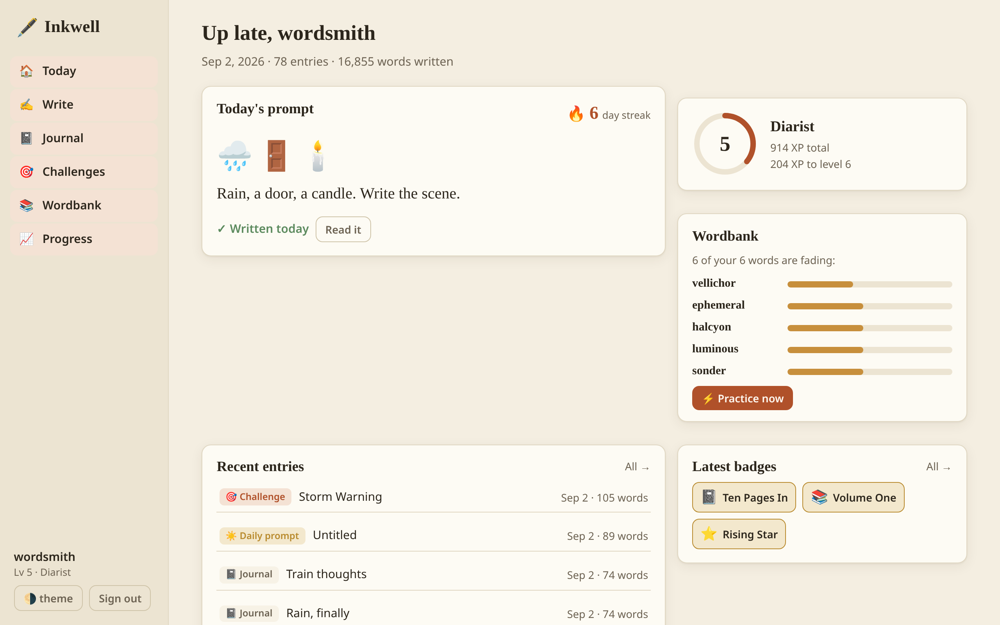
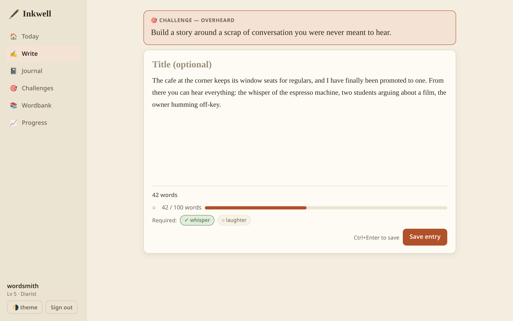
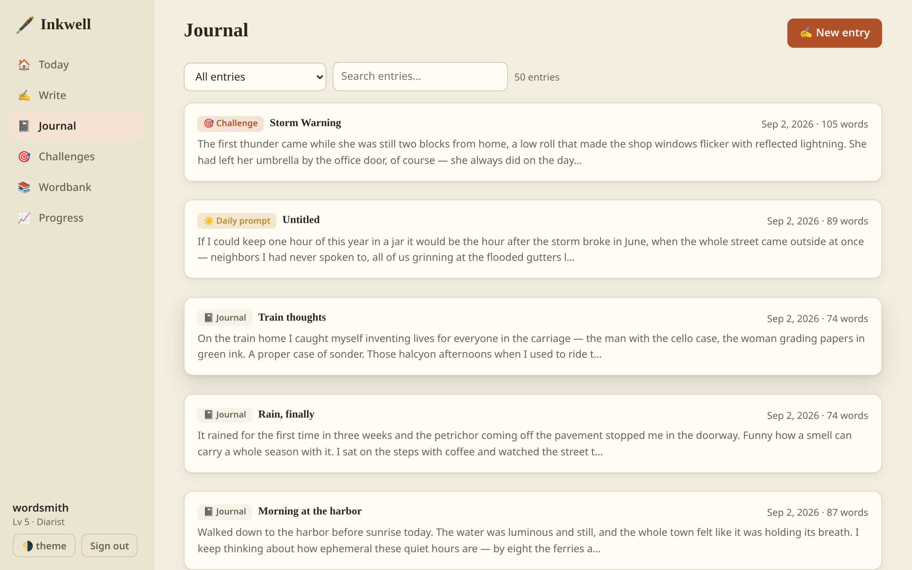
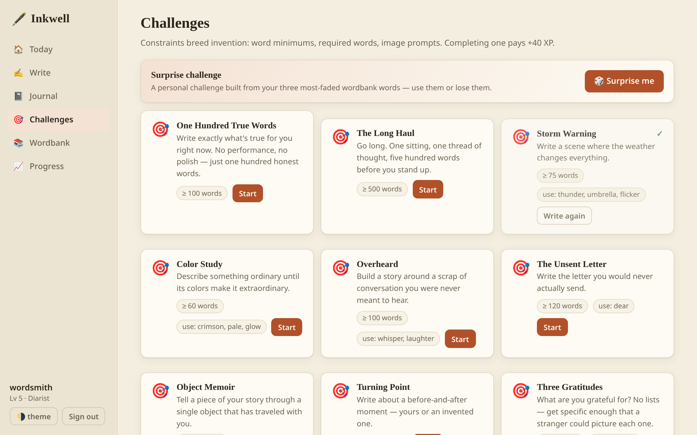
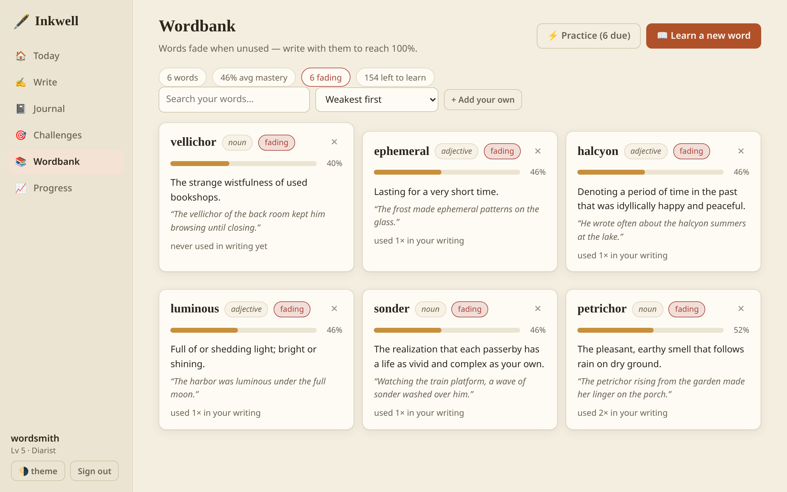
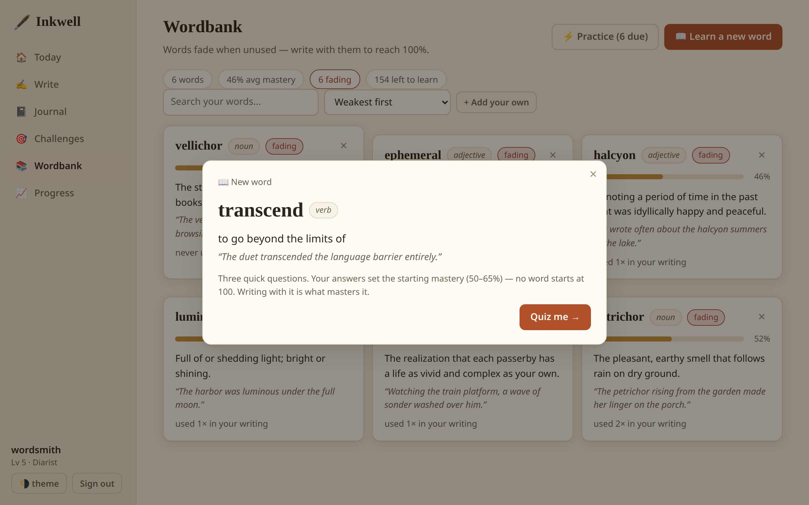
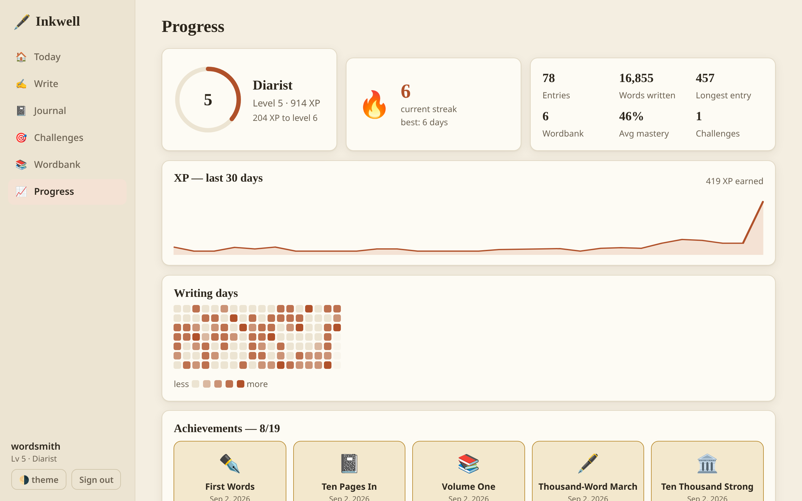

# Inkwell 🖋️

A gamified journaling and vocabulary app. Write daily, take on writing challenges,
grow a personal dictionary of words — and watch mastery fade if you stop using them.

Built from `app.pdf`. The social pillar (friends, pinboards, follower notifications)
is deliberately deferred; everything else is here.

## Quick start

```sh
just run              # that's it — uses system Node, or the flake's Node 24 if none

# equivalents:
direnv allow && npm start   # direnv provides Node 24 via the flake
nix develop -c npm start    # without direnv
nix run                     # straight from the flake
```

**No Nix?** The app is plain portable JavaScript with zero dependencies — on
macOS or Windows just install [Node 24+](https://nodejs.org) and run
`node server/index.js` (or `just run`).

Open **http://127.0.0.1:3000**, create an account (any username, 8+ char password —
purely local, no email), and write.

- `PORT` / `HOST` env vars override the default `127.0.0.1:3000`.
- Your journal lives **outside the repo** at `~/.local/share/inkwell/inkwell.db`
  (override with `INKWELL_DB=/path/to.db`). Entries are private to your machine.

## Screenshots

**Today** — your streak, the shared daily prompt, fading wordbank words, and latest badges at a glance:



**Write** — the editor enforcing a challenge's live checklist (word-count progress and required words tick off as you type):



**Journal** — searchable, filterable history of everything you've written:



**Challenges** — 12 authored constraints plus "Surprise me", which builds a personal challenge from your most-faded words:



**Wordbank** — your personal dictionary, with mastery bars that fade when words go unused:



**Learn a word** — present → quiz → placement; answers set a starting mastery of 50–65%, never 100:



**Progress** — level ring, 30-day XP sparkline, writing heatmap, and the badge gallery:



## What's inside

| Pillar | How it works |
| --- | --- |
| **Journal** | Quota-free free-writing. Live word count; entries are searchable, editable, deletable. |
| **Daily prompts** | One shared prompt per calendar day (deterministic pick from ~60 seeded prompts, some emoji-image prompts). Completing it builds a 🔥 streak. One per day. |
| **Challenges** | 12 authored challenges with word-count minimums and/or required words, enforced server-side with a live checklist in the editor. **Surprise me** generates a personal challenge from your three most-faded wordbank words. |
| **Wordbank** | Personal dictionary. *Learn a word* runs the flow from the spec: present word/definition/part-of-speech/example → two multiple-choice questions → pick-the-blank placement. Starting mastery is 50–65% — never 100 off the bat. Add your own words too. |
| **Mastery decay** | After 3 quiet days a word loses 0.5%/day (floor 20%). Practice quizzes restore up to 95%; only *using the word in real writing* reaches 100%. |
| **Writing level** | XP for entries (scales with length, capped), daily prompts (+25), challenges (+40 first completion), and wordbank words used in writing (+5 each, the "extraneous words" bonus). Level titles run Inkling → Scribbler → … → Luminary. |
| **Achievements** | 19 badges across journaling, streaks, wordbank, challenges, and levels. |
| **Progress page** | Level ring, 30-day XP sparkline, GitHub-style writing heatmap, achievement gallery. |

Quizzes are graded **server-side** (answers never reach the browser), so XP and
mastery can't be self-reported. XP is an append-only event ledger (`xp_events`).

## Stack

Deliberately minimal: **zero dependencies, no build step**.

- **Node 24** (from the Nix flake) — `node:sqlite`, `node:http`, `node:crypto` (scrypt), `node:test` cover everything.
- **SQLite** database, schema in `server/db.js`.
- **Vanilla-JS SPA** (ES modules, hash routing) served by the same process.
- `shared/wordmatch.js` is imported by both server and browser, so word detection
  (inflection-tolerant: `flicker` matches `flickering`) agrees on both sides.

```
server/
  index.js        http server + static files + API dispatch
  db.js           schema, migrations, seed loading
  auth.js         salted scrypt password hashing (versioned, rehash-on-login), hashed session tokens
  service.js      XP ledger, stats snapshot, achievements, daily-prompt pick
  routes/         auth, entries, words (+ quizzes), challenges, dashboard, stats
  domain/         pure game rules: xp, mastery, streak, quiz, achievements
  seed/           150 vocab words · 60 prompts · 12 challenges
shared/wordmatch.js   tokenizing + inflection matching (server & client)
public/               the SPA: index.html, app.css, js/views/*
test/                 unit + API integration tests (node --test)
```

## Tests

```sh
just test          # or: nix develop -c npm test
```

88 tests across four layers, all against throwaway databases:

- **Domain units** — XP rules, level curve, mastery decay, streaks, word
  matching, quiz building, achievement predicates.
- **Invariants** — property-style checks (decay never raises mastery, streak
  math vs. an independent reference, level curve consistency at every XP
  value), plus whole-catalog sweeps: every seed word must build a valid quiz,
  and no two catalog words may collide through inflection.
- **API integration & robustness** — full user flows, malformed/hostile input
  (bad JSON, oversized bodies, junk quiz answers), boundary values, restart
  persistence, idempotent re-seeding, and time-shifted behavior (backfilled
  streaks, 13-day-old words decaying on schedule).
- **Security** — cross-user isolation of entries/words/quizzes/challenges,
  expired-session rejection, cookie flags, SQL-injection probes, and
  byte-for-byte content fidelity.
- **Frontend integrity** — the no-build SPA's import graph must resolve, every
  module must be served with the right MIME type, and every `api.*` call in
  the UI must hit a route the server actually registers.

## Deferred (by request)

Friends, pinboards (community/prompt/genre), feedback & comments, nudge
notifications. The schema is user-scoped and entries are private-by-default,
so these bolt on without a rearchitect.
